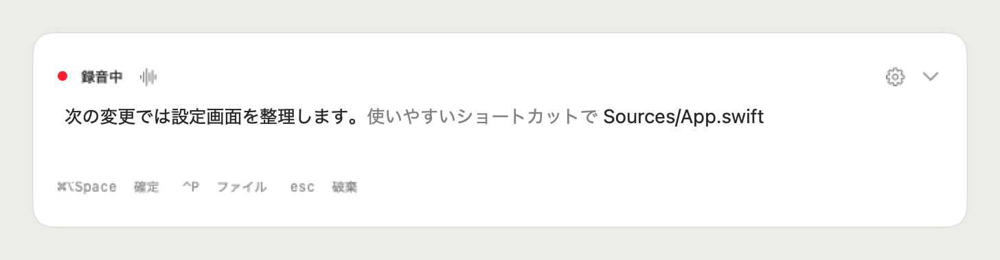

<p align="center">
  
</p>

# vox

[](https://github.com/MizuRyu/vox/releases)
[](LICENSE)

vox は、音声入力の体験を最適化した macOS 専用のローカル日本語音声入力 HUD です。

話しながら手で打ち足せて、ファイル名はサジェストからそのまま本文に入ります。確定すると、開始時に使っていたアプリへまとめて貼り付けます。

English version: [README.en.md](README.en.md)

## 特徴

- **話しながら打てる。** HUD に直接打ち込めます。音声は末尾に、打った文字はカーソル位置に入り、その間も録音は止まりません。
- **ファイル名をその場で挿入できる。** `⌃P` か `@` で検索を開くと、前面のエディタやターミナルから対象リポジトリを判定し、候補から選んだパスを本文に差し込みます。検索中も録音は続きます。
- **リアルタイムに見える。** 話した内容は画面下端の HUD に文字で出ます。確定するまで元のアプリには何も入りません。
- **確定は 1 回で貼り付け。** 録音キーをもう一度押すと、開始時に選んでいたアプリへ戻って本文をまとめて挿入します。
- **フィラーは落とす。** 「えっと」「あの」などを規則で除いてから挿入します。履歴には元のテキストが残ります。
- **端末内で動く。** 認識は Apple の `SpeechTranscriber` です。ネットワークを使うのは初回のモデル取得だけで、音声も本文も外へは送りません。
- **Enter まで任せられる（任意）。** 貼り付け後に Enter を送れます。入力欄を読み返して一致を確認してから送り、読み返せないアプリで送るかどうかだけを設定できます。



*合成文と架空のパスで作った HUD のイメージです。実際の発話や他のアプリの画面は使っていません。*

## 動作環境

macOS 26 以降の Apple Silicon Mac。初回の音声モデル取得にインターネット接続が要ります。

## 音声認識モデル

Apple の `Speech` framework（macOS 26 で追加された `SpeechAnalyzer` と `SpeechTranscriber`）をロケール `ja_JP` で使います。他のモデルは同梱していません。

| 項目 | 内容 |
|---|---|
| 実行場所 | 端末内。モデルは OS が管理し、Vox のバイナリにもメモリにも乗らない |
| 初回 | OS が日本語モデルを取得する（数十秒）。以後はネットワーク不要 |
| 途中結果 | `.fastResults` を有効にし、発話中は約 1 秒周期で本文を更新 |
| 送信 | 音声も本文も外部へ送らない |

採用理由と、比較した候補（Parakeet、Whisper 系）は [docs/specs/02-speech-engines.md](docs/specs/02-speech-engines.md) にまとめています。

## インストール

次の 1 行で、最新 Release の取得、`/Applications` への配置、quarantine 属性の解除まで行います。更新も同じコマンドです。

```sh
curl -fsSL https://raw.githubusercontent.com/MizuRyu/vox/main/scripts/install.sh | bash
```

手動で入れる場合は [Releases](https://github.com/MizuRyu/vox/releases) から `.dmg` をダウンロードし、`Vox.app` を `/Applications` に置いてから quarantine 属性を外します。Developer ID 署名と公証をしていないため、初回だけこの手順が要ります。

```sh
xattr -dr com.apple.quarantine /Applications/Vox.app
```

初回起動ではセットアップ画面が開き、マイク、アクセシビリティ、入力監視の順に許可します。反映されないときは「状態を再確認」を押してください。macOS が再起動を求めた場合は Vox を終了して開き直します。


*権限を 2 項目まで許可した状態の表示例です。実際の許可状態は起動時に確認します。*

ソースからビルドする場合は `just install` で `/Applications/Vox.app` に配置できます。手順は [開発手順](docs/development.md) を参照してください。

## 使い方

1. 貼り付けたい入力欄にカーソルを置き、`⌘⇧Space` を押します。
2. 話しながら HUD の本文を確認します。必要なら直接打ち込み、ファイル検索でパスを挿入します。
3. `⌘⇧Space` をもう一度押すと確定し、元のアプリへ貼り付けます。

| キー | 操作 |
|---|---|
| `⌘⇧Space` | 録音開始／確定して貼り付け |
| `⌃P` または HUD に `@` を入力 | ファイル検索 |
| パレットで `Enter` | パスを本文へ挿入。フォルダ行では展開／折り畳み、worktree 候補では検索対象を切り替え |
| `Esc` | パレットを閉じる。録音画面では本文を破棄 |
| `⌘,` | Vox にフォーカスがあるとき、設定を開く |

ファイル検索は `Changes` と `Tree` を切り替えられます。Changes は変更ファイルを先に、Tree は索引済みのファイルを階層で表示します。


*実際のビューを架空のファイル名と本文で描画した例です。*

操作、権限、制約の詳細は [使い方](docs/usage.md) にあります。

## 設定


*本体と同じ設定ビューを、合成した設定と架空のマイク情報でオフスクリーン描画しています。*

設定画面はメニューバーの「設定…」、HUD の歯車、`⌘,` のいずれかで開きます。変えられるのは録音とファイル検索のショートカット、自動Enterとターミナルでの送信、通話向けの音声処理（実験的）です。接続中のマイクの一覧もここで確認できます。各項目の意味は [使い方](docs/usage.md#設定) を参照してください。

## 開発

```sh
nix develop
just setup
just build
just test
just verify
```

セットアップ、検査、配布は [開発手順](docs/development.md)、仕様と技術判断は [ドキュメント一覧](docs/README.md) を参照してください。

## License

[MIT](LICENSE)

ベンチマーク用ターゲットだけが依存する FluidAudio（Apache-2.0）のライセンス原文は [THIRD-PARTY-LICENSES.md](THIRD-PARTY-LICENSES.md) に収録しています。本体には含まれません。
