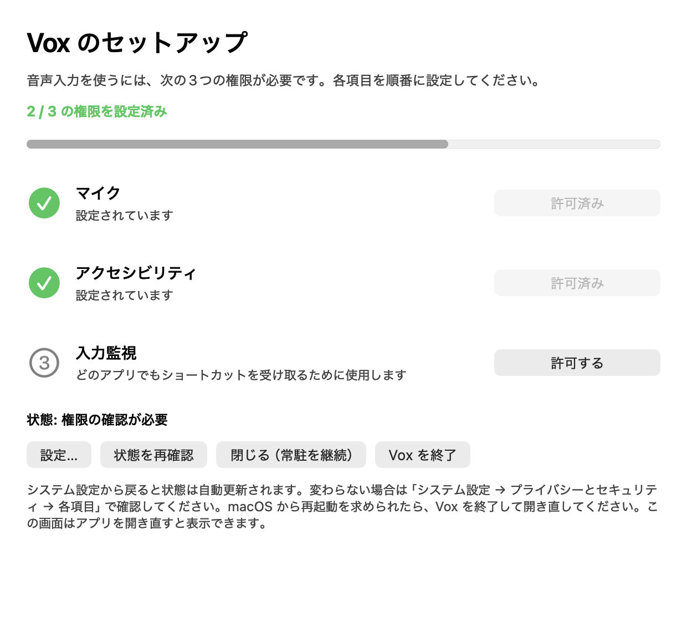
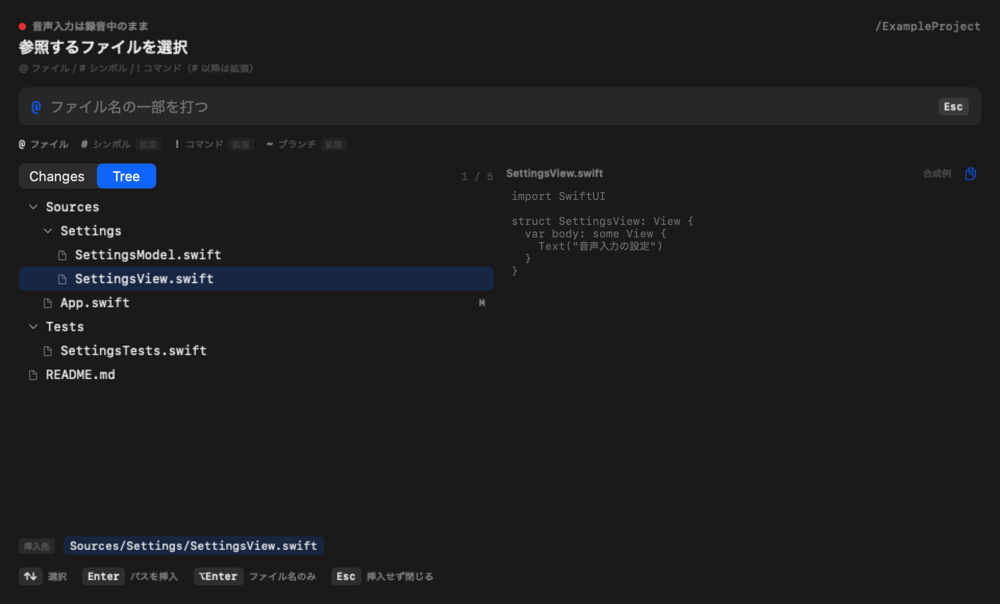
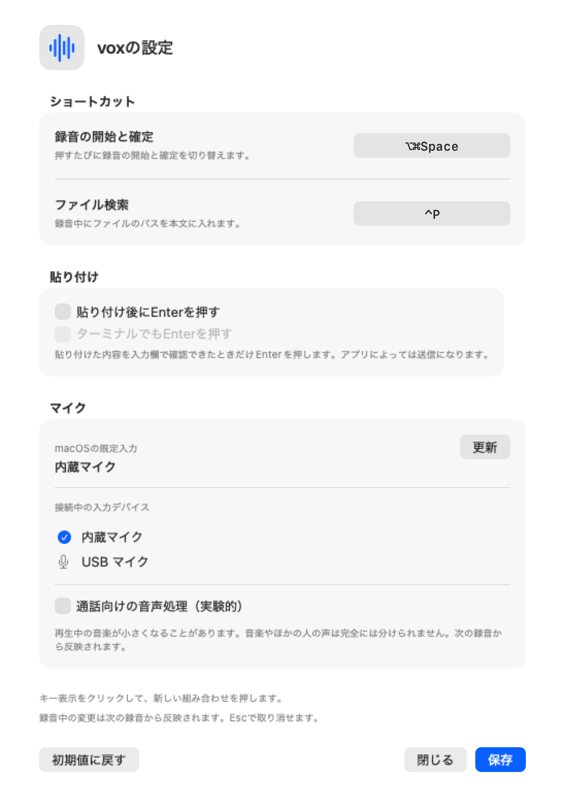

# 使い方

Vox の起動、録音、ファイル検索、設定、データ保存と現在の制約をまとめます。必要な環境と最初の起動は [README](../README.md) を参照してください。

## 起動と終了

Applications に置いた `Vox.app` を開きます。起動中は Dock とメニューバーに Vox が表示され、どちらからも設定と終了へ進めます。メニューが見つからないときは `Vox.app` をもう一度開くと、セットアップ画面が開きます。

ウィンドウを閉じても常駐は続きます。アプリ自体を止めるには「Voxを終了」を選びます。「ログイン時に開く」は任意で有効にできます。

ソースからの起動、必要な開発環境、ログの確認方法は [開発手順](development.md) にあります。

## 初回の権限設定

初回はセットアップ画面で、マイク・アクセシビリティ・入力監視を順に許可します。許可済みの項目には緑のチェックが付き、システム設定から戻ると進捗が更新されます。反映されない場合は「状態を再確認」を押し、macOS が再起動を求めた場合は Vox を終了して開き直してください。

*権限を2項目設定済みとした表示例です。実際の許可状態は起動時に確認します。*

### 更新後に権限が効かなくなったとき

macOS はコード署名の要件でアプリの同一性を判定します。署名 identity が変わった版に入れ替えると、以前のアクセシビリティ・入力監視の許可が無効になります。その場合は Vox を終了し、システム設定の「プライバシーとセキュリティ → アクセシビリティ」で Vox の項目を削除してから、`/Applications/Vox.app` を追加して許可し直し、開き直してください。入力監視も同様です。

## 録音と貼り付け

1. 貼り付けたい入力欄にカーソルを置き、録音キー（既定 `⌘⇧Space`）を押します。
2. 話しながら HUD の本文を確認します。必要なら直接入力・編集し、ファイル検索でパスを挿入します。
3. 録音キーをもう一度押します。本文が確定し、最初に選んだアプリへ貼り付けられます。

`Esc` を押すと録音中の本文を破棄します。貼り付け前には元のアプリと、取得できる場合は入力欄を再確認します。入力欄を取得できないアプリでは、同じプロセスかどうかまでの確認になります。クリップボードの受領通知は、相手アプリへの挿入完了や送信完了を保証しません。

## ショートカット

| キー | 操作 |
|---|---|
| `⌘⇧Space` | 録音開始／確定して貼り付け（既定） |
| `⌃P` または HUD に `@` を入力 | 録音中にファイル検索を開く（既定） |
| パレットで `Enter` | ファイルのパスを本文へ挿入。Tree のフォルダ行では展開／折り畳み、worktree 候補では検索対象を切り替え |
| `Esc` | パレットを閉じる。録音画面では本文を破棄 |
| `⌘,` | Vox の HUD や設定画面にフォーカスがあるとき、設定を開く |

設定画面でキー表示をクリックし、組み合わせを押して「保存」します。⌘・⌃・⌥ のいずれかを含む組み合わせ、または F1〜F12 を登録できます。録音とファイル検索に同じキーは設定できません。

キーを決める優先順位は、**起動引数、保存設定、既定値**の順です。起動引数で固定したキーは、その起動中は設定画面で編集できません。変更は待機中ならすぐ反映され、録音中なら次の録音から使われます。「初期値に戻す」も保存後に反映されます。

## ファイル検索

録音中に検索キー（既定 `⌃P`）を押すか、HUD に `@` を入力するとファイル検索が開きます。ファイルを選んで `Enter` を押すと、検索対象からの相対パスを本文へ挿入します。パスの挿入はファイル内容の送信ではありません。

`Changes / Tree` で表示を切り替えられます。Changes は変更されたファイルを優先して表示します。Tree は索引済みのファイルを階層表示し、同じ階層ではフォルダを先に並べます。三角ボタンまたはフォルダ行の `Enter` で展開・折り畳み、検索中は一致したファイルの親フォルダを自動で展開します。空フォルダや索引にないファイルは表示しません。

Git 管理下では、追跡されていない ignore 対象を除外します。追跡済みのファイルは、後から ignore 対象にしても索引に残ります。Git 管理外では `fd` があれば ignore 設定を反映しますが、`fd` がない場合の代替処理は `.gitignore` を解釈しません。

*実ビューを架空のファイル名と本文で描画した例です。*

Orca を前面で使っている場合は、Orca の画面でアクティブなローカル worktree を検索対象にします。対象が一意に決まらない場合は、設定済みの検索フォルダがあればそちらを使います。

現在の検索対象が Git worktree の場合、同じリポジトリにある別の worktree を自動で調べます。候補はクエリが空の Changes 表示でファイル行の前に並び、`worktree` バッジが付きます。候補を選ぶとパスを挿入せず、その worktree に検索対象を切り替えて索引を読み直します。検索中と Tree 表示には候補を出しません。

プレビューは検索対象内の通常ファイルに限り、最大 64 KiB・40行です。検索対象外のファイル、シンボリックリンク、特殊ファイルの本文は開きません。

## 設定

設定は、メニューバーの「設定…」、HUD の歯車、Vox にフォーカスがあるときの `⌘,` から開きます。本体が動いていなくても、録音を始めずに設定画面だけを表示できます。

*本体と同じ設定ビューを、合成設定・架空のマイク情報でオフスクリーン描画しています。*

設定は `~/Library/Application Support/vox/settings.json` に保存します。

### 自動 Enter

「貼り付け後にEnterを押す」をオンにして保存すると、次の録音から有効になります。既定はオフです。送り方は選びません（[ADR-014](adr/014-auto-enter-readability-decides.md)）。

- 入力欄を読み返せるアプリでは、本文・カーソル・入力先が一致した場合だけ Enter を送ります。
- 読み返せないアプリ（ターミナルなど）では、「ターミナルでもEnterを押す」をオンにした場合だけ、貼り付けから 0.5 秒以上待ち、同じアプリ・ウィンドウであれば Enter を送ります。オフのままなら送りません。以前「貼り付け後に送る」を選んでいた設定は、この項目のオンとして自動で引き継ぎます。

どちらの場合も、修飾キーが離されるまで期限内で待ちます。押されたままの場合、入力先が変わった場合、クリップボードが競合した場合は Enter を省略します。確定待ち中に `Esc` を押すと Enter だけを取り消せます。

読み返せないアプリでは、同じウィンドウ内のタブや入力先の変更までは判別できません。アプリによっては Enter が送信やコマンド実行になるため、最初は送信の起きない入力欄で確認してください。

### マイクと実験的な音声処理

「マイク」には macOS の既定入力と利用可能な入力デバイスを表示します。設定を開くたびに取得し、接続後は「更新」でも確認できます。マイクの切り替えは macOS のサウンド設定で行います。各デバイスには接続方式（「内蔵」「Bluetooth」「USB」など）のラベルが付き、分類できない接続方式には付きません。この表示は、録音中の実際の入力経路を保証するものではありません。

「通話向けの音声処理（実験的）」は、Apple のエコー除去・ノイズ抑制を使います。既定はオフで、保存後の次の録音から反映されます。再生中の音楽自体が小さくなる場合があるため、再生音量を保ちたい場合はオフにしてください。自動音量低下を最小にしても無効にはなりません。音楽と他人の声を完全には分離できず、音楽再生中の適切な収録方法は調査中です。[Apple の音声処理の説明](https://developer.apple.com/videos/play/wwdc2023/10235/)

原因を切り分ける場合は、メニューバーで「音声診断を記録（音声は保存しません）」をオンにしてから普段どおり録音し、「診断ログを開く…」で確認します。変換前のチャンネル数、形式、音量の集計だけを1録音につき最大16回記録します。音声サンプルや本文は保存せず、オンにするだけでは録音しません。

## データ保存と現在の制約

確定本文は端末内の履歴に保存します。診断ログへの本文出力は既定でオフになっており、`--log-text` を指定した場合だけ有効です。保存先は [開発手順](development.md#データの場所) に記載しています。

本体からの音声認識モデル切り替えと、検索対象として任意のフォルダを選ぶ機能は未実装です。
